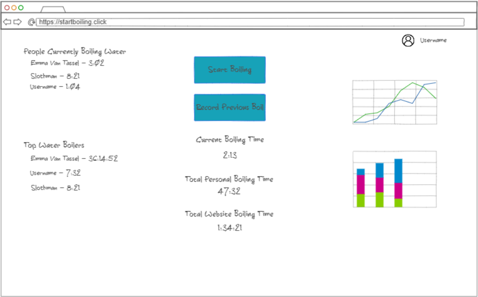

# StartBoiling
[Notes](notes.md)

## Elevator Pitch
Have you ever wondered how much time you've spent boiling water?

What about how often your friend boils water?

What about a total strangers water boiling habits?

Well, wonder no more with this new website: [**startboiling.click**](http://startboiling.click)

This website allows you to track your boiling and see who else is boiling water at the same time. You can also rack up boiling time to become one of the **Top Water Boilers**, or just look at the list and be in awe of them.

## Design

### Key Features
- Ability to track your water boiling time
- Users currently boiling water displayed
- Top water boilers displayed
- Time spent boiling displayed for you and other users
- Charts showing when water was boiled
- Ability to record a previous instance of boiling water

## Technologies
**Authentication** - Users can create an account or login, once logged in their username will be displayed at the top of the page  
**Database Data** - Rendering the time spent boiling water for all users, which will be stored in the database.  
**WebSocket data** - Rendering the users currently boiling water in realtime.